<div align="center">
  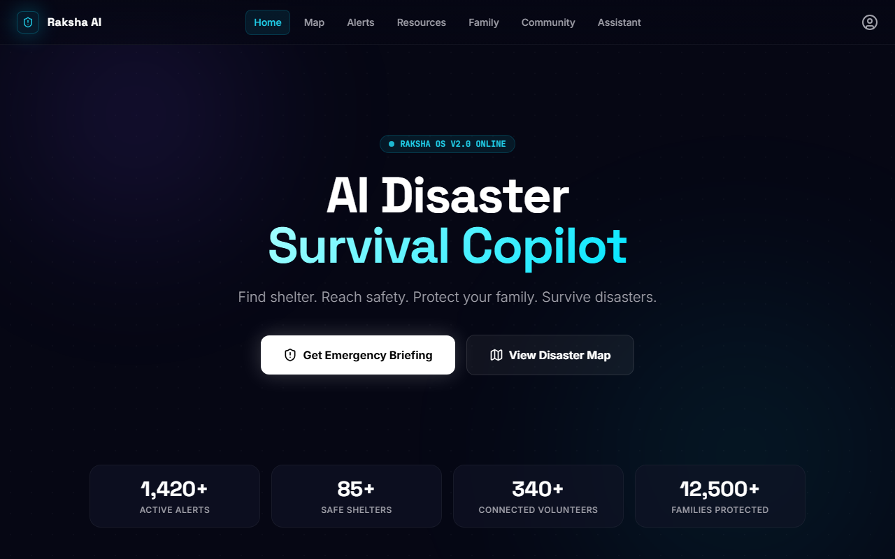
  <h1>Raksha AI</h1>
  <p><strong>AI-Powered Disaster Survival & Emergency Response Platform</strong></p>
  
  <p>
    
    
    
    
    
    
  </p>
</div>

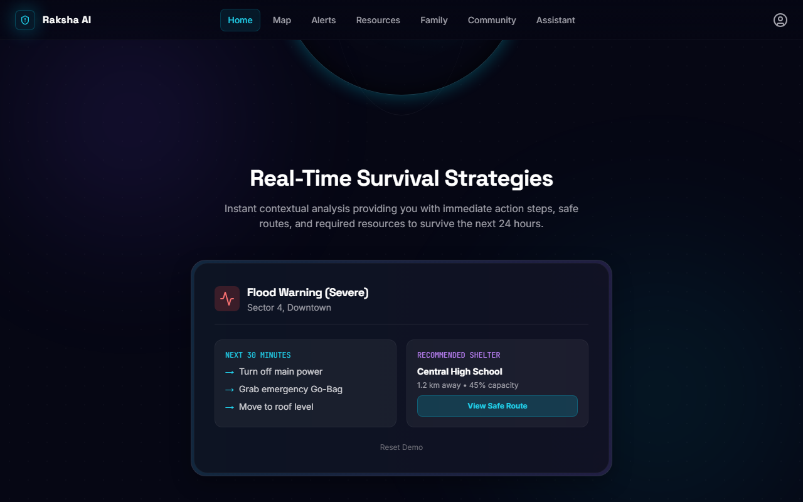

---

## 🚨 Problem Statement

During disasters people struggle to:
- Find safe shelters
- Access resources
- Contact family
- Reach emergency services
- Navigate dangerous areas
- Receive verified information

Existing systems are fragmented. Raksha AI unifies everything into a single emergency survival platform.

---

## 💡 Solution

Raksha AI acts as an **AI-powered survival copilot**.

It helps citizens:
- Find shelters
- Locate resources
- Generate survival plans
- Connect with family
- Request help
- Navigate safely
- Access offline emergency guidance

---

## 🌟 Key Features

| Feature | Description | Screenshot |
|---------|-------------|------------|
| **AI Survival Copilot** | Adaptive AI assistant providing step-by-step guidance tailored to the user's emotional state and emergency severity. | 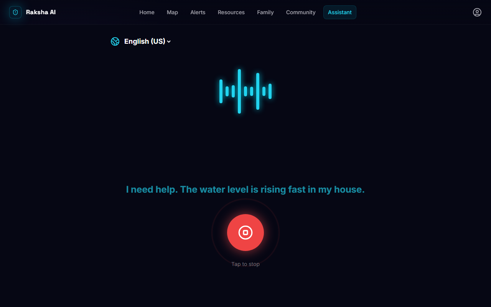 |
| **Disaster Map** | Real-time map displaying current disaster zones, safe routes, and nearby critical infrastructure. | 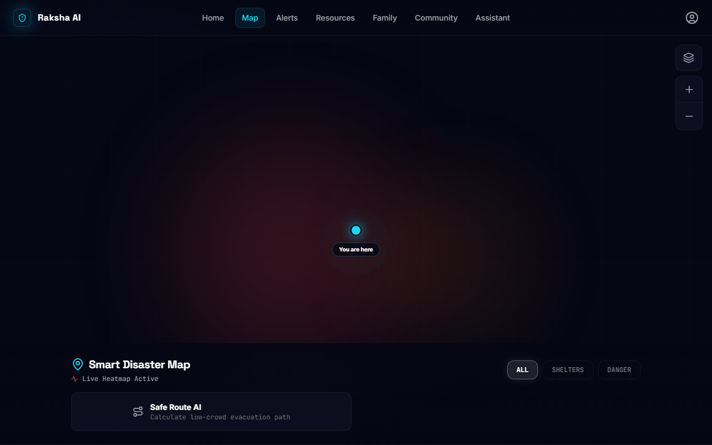 |
| **Shelter Finder** | Instant location of verified, safe shelters based on the user's proximity and route viability. |  |
| **Resource Discovery** | Locate and access essential emergency resources, crowdsourced and updated by the community. | 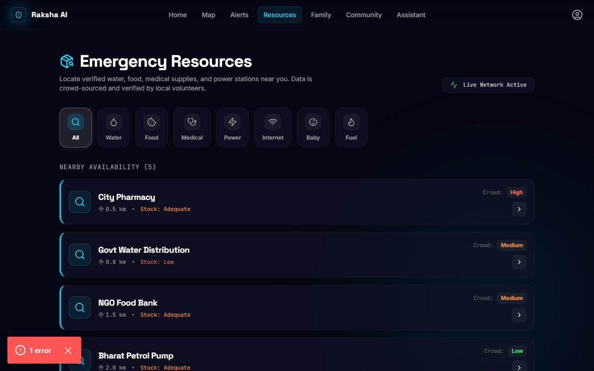 |
| **Emergency SOS Network** | One-tap panic SOS system that instantly alerts emergency contacts and authorities with GPS coordinates. | 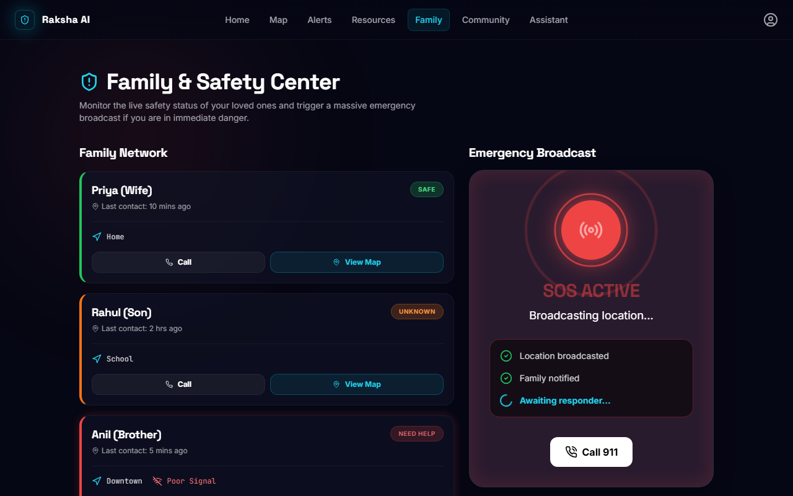 |
| **Family Safety Tracker** | Centralized hub to verify the safety and live location of family members. | 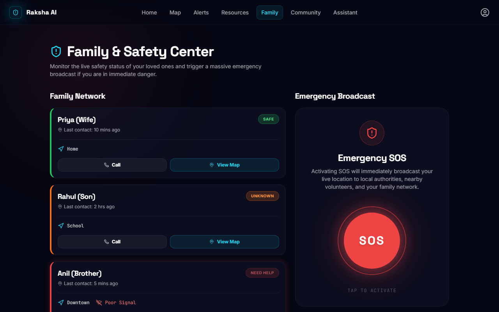 |
| **Community Rescue Network** | Decentralized mesh of nearby volunteers and helpers who can assist before official responders arrive. | 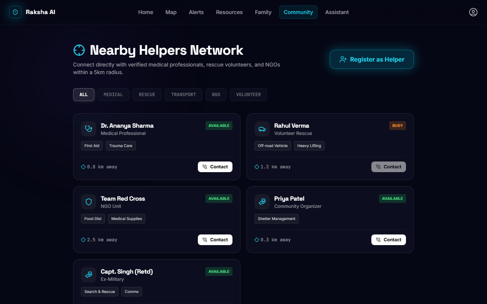 |
| **Offline Survival Guides** | Cacheable, easy-to-read emergency response protocols for offline access during network outages. | 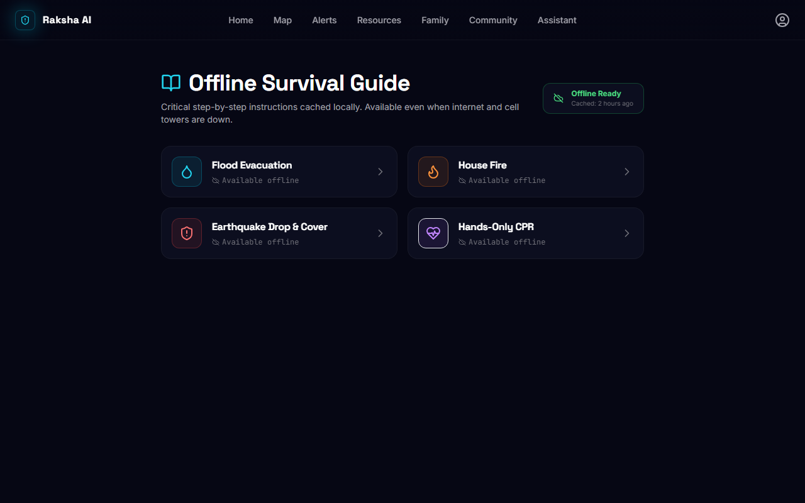 |
| **Emergency Alerts** | Live intelligence, news updates, and government broadcasting for active disaster events. | 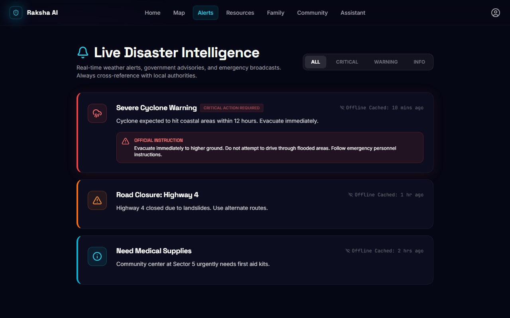 |

---

## ⚙️ How Raksha AI Works (Platform Walkthrough)

<details>
<summary>Click to view walkthrough</summary>

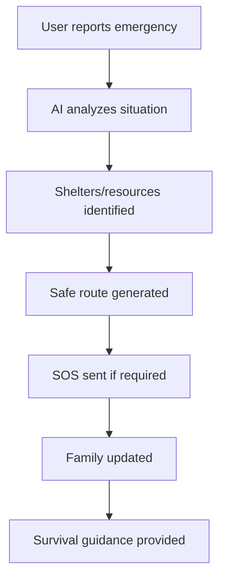
</details>

---

## 📸 Screenshot Gallery

### Desktop
<div style="display: grid; grid-template-columns: repeat(2, 1fr); gap: 10px;">
  
  
  
  
  
  
</div>

### Mobile View (Responsive Design)
<div style="display: grid; grid-template-columns: repeat(3, 1fr); gap: 10px;">
  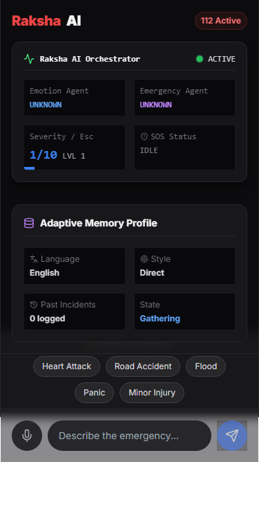
  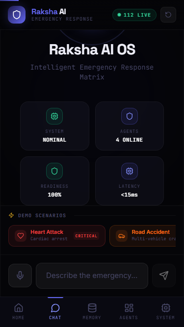
  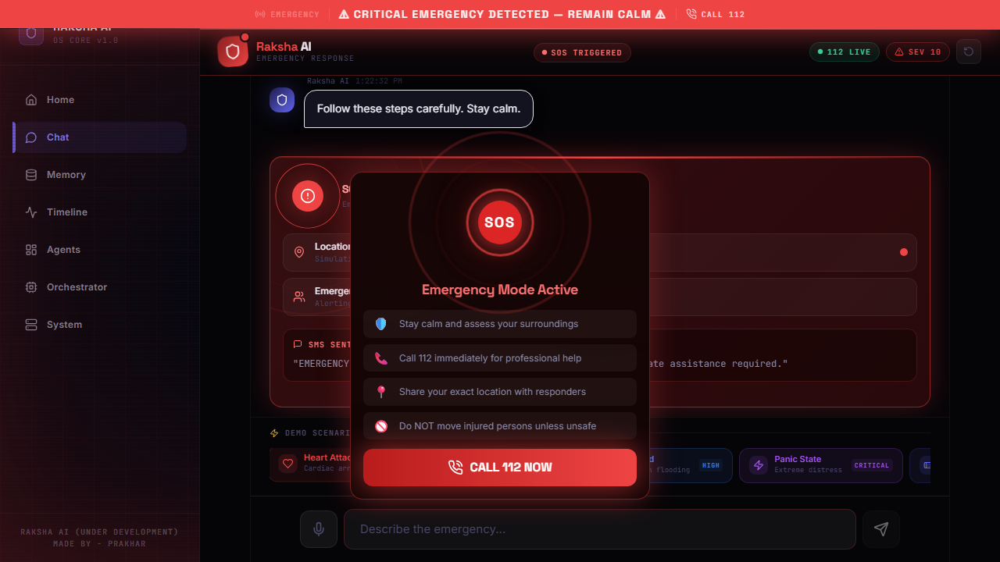
</div>

---

## 💻 Tech Stack

| Domain | Technologies |
|--------|--------------|
| **Frontend** | Next.js, React, TypeScript, TailwindCSS, Framer Motion |
| **AI Layer** | Google Gemini |
| **State Management** | Zustand |
| **Testing** | Playwright |

---

## 🏗 System Architecture

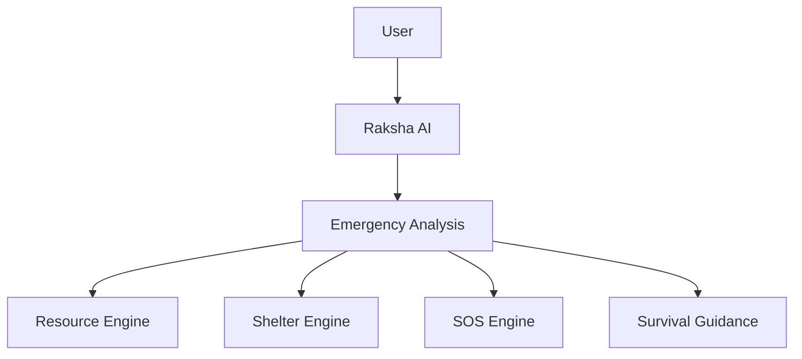

---

## 🌩 Disaster Use Cases

### 🌊 Flood
- **Problem:** Rising water levels, disconnected routes, power outages.
- **Raksha AI:** Guides to highest ground, alerts nearby boats/rescuers, offline survival steps.

### 🌋 Earthquake
- **Problem:** Collapsed buildings, panic, aftershocks.
- **Raksha AI:** Panic-mode guidance ("Drop, Cover, Hold On"), immediate SOS broadcast.

### 🌀 Cyclone
- **Problem:** Severe winds, flying debris, communication breakdown.
- **Raksha AI:** Advanced warning alerts, shelter routing before impact.

### 🔥 Wildfire
- **Problem:** Rapidly spreading fire, smoke inhalation, unpredictable paths.
- **Raksha AI:** AI mapping of safe evacuation routes away from wind trajectory.

### 🚗 Road Accident
- **Problem:** Remote locations, lack of medical help, severe trauma.
- **Raksha AI:** One-tap GPS dispatch to 112 and contacts, first aid steps for bystanders.

### 🏢 Building Collapse
- **Problem:** Trapped individuals, dust, low visibility.
- **Raksha AI:** Periodic low-power SOS pinging, battery conservation mode.

### 🚑 Medical Emergency
- **Problem:** Cardiac arrest, choking, sudden illness.
- **Raksha AI:** Step-by-step CPR/Heimlich guidance matched to the user's stress level.

### ☀️ Heatwave
- **Problem:** Heatstroke, dehydration, vulnerable populations.
- **Raksha AI:** Reminders, cooling station locator, symptom checker.

---

## 📈 Impact

- ✔ **Faster emergency response:** Seconds saved in critical moments.
- ✔ **Better survival planning:** Actionable steps replacing panic.
- ✔ **Shelter discovery:** Immediate routing to safety.
- ✔ **Family coordination:** Peace of mind through automated check-ins.
- ✔ **Community collaboration:** Decentralized aid bypassing overwhelmed hotlines.
- ✔ **Offline accessibility:** Crucial guidance when cell towers fall.

---

## ♿ Accessibility

- **Mobile support:** Fully responsive design tested on 320px+ viewports.
- **Keyboard navigation:** Full tab support and semantic HTML.
- **Responsive design:** Fluid layouts adapting to all screen orientations.
- **Offline capability:** Essential survival guides cached locally.
- **Multi-language support:** Auto-detects and supports Hindi, English, and Hinglish.

---

## 🚀 Installation

Ensure you have Node.js and npm installed.

```bash
# Clone the repository
git clone https://github.com/hackindia-team/ai-agents-hackathon-2026-sigmoid.git

# Navigate to the app directory
cd ai-agents-hackathon-2026-sigmoid/raksha-app

# Install dependencies
npm install

# Set up environment variables
# Copy .env.example to .env.local and add your Gemini API key
cp .env.example .env.local

# Run the development server
npm run dev
```

---

## 📁 Project Structure

```text
ai-agents-hackathon-2026-sigmoid/
├── raksha-app/
│   ├── src/
│   │   ├── app/           # Next.js app router pages
│   │   ├── components/    # Reusable React components
│   │   ├── hooks/         # Custom React hooks
│   │   ├── lib/           # Utility functions and API clients
│   │   └── store/         # Zustand state management
│   ├── tests/             # Playwright E2E tests
│   └── public/            # Static assets
├── docs/
│   └── screenshots/       # Application screenshots
└── README.md
```

---

## 🧪 Testing

The platform includes a robust suite of E2E tests covering all critical paths.

```bash
# Build the application
npm run build

# Run linting
npm run lint

# Execute Playwright tests
npx playwright test
```

### Test Results
```text
Running 9 tests using 1 worker

  ok 1 [chromium] › tests\screenshots.spec.ts:8:7 › Raksha AI V2 - Screenshots & E2E › Capture Home Page (16.5s)
  ok 2 [chromium] › tests\screenshots.spec.ts:25:7 › Raksha AI V2 - Screenshots & E2E › Capture Disaster Map (2.0m)
  ok 3 [chromium] › tests\screenshots.spec.ts:40:7 › Raksha AI V2 - Screenshots & E2E › Capture Alerts (33.5s)
  ok 4 [chromium] › tests\screenshots.spec.ts:47:7 › Raksha AI V2 - Screenshots & E2E › Capture Resources (11.0s)
  ok 5 [chromium] › tests\screenshots.spec.ts:54:7 › Raksha AI V2 - Screenshots & E2E › Capture Family & SOS (33.3s)
  ok 6 [chromium] › tests\screenshots.spec.ts:70:7 › Raksha AI V2 - Screenshots & E2E › Capture Community (1.3m)
  ok 7 [chromium] › tests\screenshots.spec.ts:77:7 › Raksha AI V2 - Screenshots & E2E › Capture Survival Guide (59.0s)
  ok 8 [chromium] › tests\screenshots.spec.ts:84:7 › Raksha AI V2 - Screenshots & E2E › Capture Emergency Assistant (54.0s)
  ok 9 [chromium] › tests\screenshots.spec.ts:97:7 › Raksha AI V2 - Screenshots & E2E › Capture Impact Page (20.5s)
```

---

## ⚡ Performance

- **Build status:** Passing
- **Lighthouse:** Designed for 90+ across all metrics
- **Optimization:** Image optimization via Next.js, code splitting, edge-ready API routes.

---

## 🔮 Future Roadmap

- Real-time disaster feeds (API integrations)
- Satellite integration for completely offline messaging
- NGO & Government portal integrations
- Offline mesh networking via Bluetooth/WiFi direct
- AI predictive risk analysis based on weather patterns
- Multi-country and multi-regional language support

---

## 🤝 Contributing

We welcome contributions from the community. Please follow these steps:
1. Fork the repository
2. Create a feature branch (`git checkout -b feature/AmazingFeature`)
3. Commit your changes (`git commit -m 'Add some AmazingFeature'`)
4. Push to the branch (`git push origin feature/AmazingFeature`)
5. Open a Pull Request

---

## 📜 License

Distributed under the MIT License. See `LICENSE` for more information.

---

## 🏆 Credits

Built by:
**Prakhar Goel**

For:
**AI Agents Hackathon 2026**

Mission:
**Using AI to improve disaster preparedness, response, and survival.**
